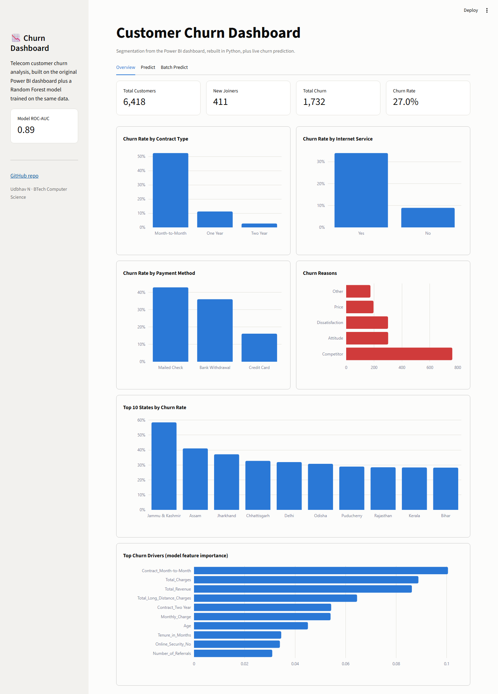
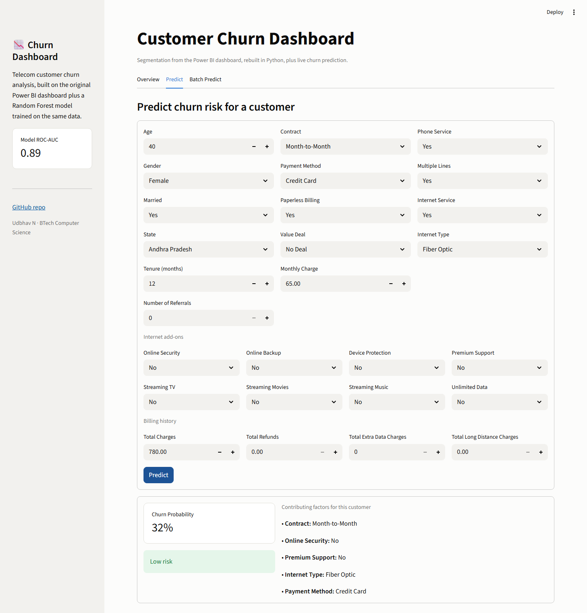
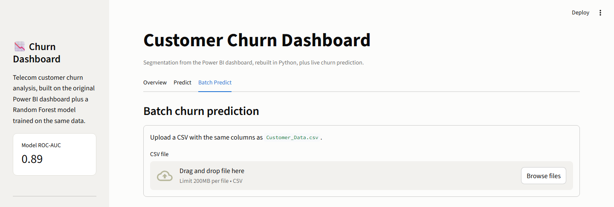

# Churn Analysis Dashboard

A customer churn project for a telecom-style dataset, built two ways: a Power BI
dashboard for exploratory analysis, and a Python ML pipeline + Streamlit app for
predicting churn on new customers.

---

### Project Overview

The dataset covers 6,418 customers — demographics, subscribed services, contract
and billing details, and churn status. The project answers two different
questions:

* **Power BI dashboard** — why did customers churn, historically? (segmentation,
  trends, geographic patterns)
* **ML app** — given a customer's profile, how likely are they to churn *next*?

---

### Screenshots

**Overview**


**Predict**


**Batch Predict**


---

### Key Highlights

* **Total Customers:** 6,418
* **New Joiners:** 411
* **Total Churn:** 1,732
* **Churn Rate:** 27.0%

---

### Tech Stack

* Power BI — dashboard, DAX measures, Power Query transformations
* Python (pandas, scikit-learn) — data cleaning, feature engineering, model training
* Streamlit + Plotly — interactive web app (dashboard + live/batch prediction)

---

### Repo Structure

```
├── app.py              Streamlit app (dashboard + predictions)
├── ml/
│   ├── data.py         shared data loading & feature definitions
│   └── train.py        trains and evaluates the churn model
├── models/
│   ├── churn_model.joblib   trained sklearn pipeline
│   └── metrics.json         evaluation results + feature importances
├── data/
│   └── Customer_Data.csv
├── dashboard/
│   ├── Chrun Analysis.pbix
│   ├── SQL Queries.docx
│   └── Power Query Transformations & Measures.docx
└── requirements.txt
```

---

### Machine Learning

Target: `Customer_Status == Churned` vs `Stayed` (customers marked `Joined` are
excluded — they haven't been around long enough to churn yet, so the label isn't
meaningful for them). `Churn_Category` and `Churn_Reason` are dropped from the
features since they're only populated *after* a customer has already churned —
using them would leak the answer.

Two models were trained and compared on a held-out 20% test set, both with
`class_weight="balanced"` to account for the ~29% churn rate in the training
data:

| Model | Accuracy | Precision | Recall | F1 | ROC-AUC |
|---|---|---|---|---|---|
| Logistic Regression | 78.2% | 58.9% | 81.0% | 0.68 | 0.871 |
| **Random Forest (selected)** | **84.5%** | **80.8%** | **60.8%** | **0.69** | **0.892** |

Top predictors of churn (by Random Forest feature importance): contract type
(month-to-month churns most, two-year churns least), total charges/revenue,
long-distance charges, monthly charge, age, tenure, and whether the customer
has online security.

Retrain with:

```bash
python ml/train.py
```

This overwrites `models/churn_model.joblib` and `models/metrics.json` with
fresh results.

---

### Streamlit App

Three tabs:

* **Overview** — churn KPIs and the same kind of segmentation views as the Power
  BI dashboard (by contract, internet service, payment method, state, churn
  reason), plus the model's feature importances.
* **Predict** — fill in a single customer's details and get a churn probability
  with a risk level (Low / Medium / High).
* **Batch Predict** — upload a CSV in the same shape as `Customer_Data.csv` and
  get churn probabilities for every row, downloadable as CSV.

Run locally:

```bash
pip install -r requirements.txt
python ml/train.py        # only needed once, or after changing the data/model
streamlit run app.py
```

**Live demo:** _add your Streamlit Community Cloud link here after deploying_

---

### Dashboard Insights

* Higher churn in month-to-month contracts and fiber optic users
* Lower churn in one/two-year contracts
* Certain states show noticeably higher churn
* Customers with fewer add-on services churn more

---

### Business Use Case

* Flag high-risk customers before they leave
* Target retention offers using the Predict/Batch Predict tabs
* Use the Overview tab's segmentation to inform pricing and service bundling

---

### Future Improvements

* Deploy the Streamlit app (Community Cloud)
* Add SHAP-based per-prediction explanations
* Real-time data integration

---

### Author

**Udbhav N**
BTech Computer Science
